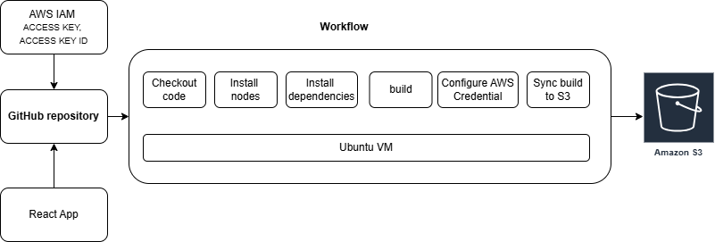

# CICD project
A simple CICD pipeline to deploy a Simple React frontend app to AWS S3 using GitHub Actions. A Github workflow is created to checkout the code from Git Repo, installing nodes, installing dependencies and build and deploy the new build to S3 bucket using AWS CLI. This workflow will be triggered by code push to Github.

### Diagram

## React Frontend App
This simple frontend was bootstrapped with [Create React App](https://github.com/facebook/create-react-app).

## Static web hosting on AWS S3 bucket
The React Frontend App will be hosted on S3 static website hosting. Created AWS S3 resource using the cloudformation temple file in the infrastucture folder. The URL for static hosting website is shown in S3 bucket's properties tab under Static website hosting->bucket website endpoint.

### GitHub setup
Repository->settings->security->Secrets and variable
- Create Repository secrets
AWS_ACCESS_KEY_ID  
AWS_SECRET_ACCESS_KEY  

- Create Repository variables
AWS_REGION - us-east-1
NODE_VERSION - 18.15.0

### .github/Workflows - main.yaml
    1. checkout code from repository
    2. install nodes required for installing dependencies and build app
    3. install dependencies (npm install)
    4. build and 
    5. setup AWS CLI (required AWS IAM role with S3 permissions)
    5. deploy build folder to S3 bucket using AWS CLI

## Setup AWS CLI 
- IAM role must be created for this use
- Configure aws CLI

## Usage
- Update code and push to Github repo.
- GitHub will be trigger to deploy new frontend build to S3 bucket
- Check the actions output in the Actions tab of repository
- Access the URL of the S3 bucket static hosting website for the new build